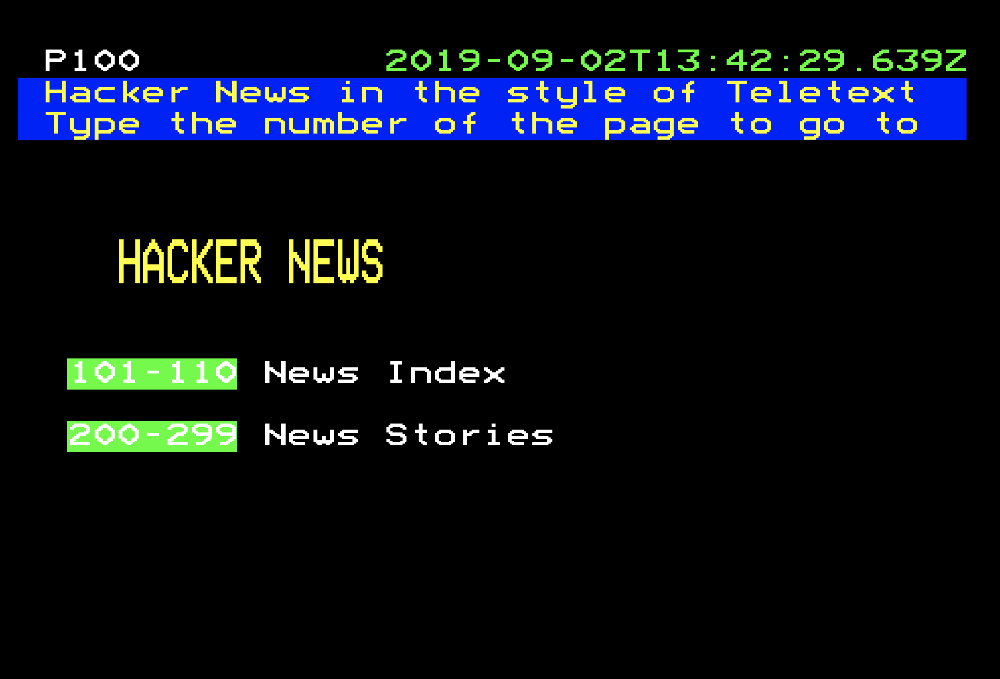

# teletext

A Vue.js app that renders Hacker News as a teletext service.

It uses PouchDB to cache stories locally. 

[Live Demo](https://glynnbird.github.io/teletext)

## Credits

- [Teletext font and styling](http://www.galax.xyz/TELETEXT/INDEX.HTM) 
- [he entity decoder](https://github.com/mathiasbynens/he0)